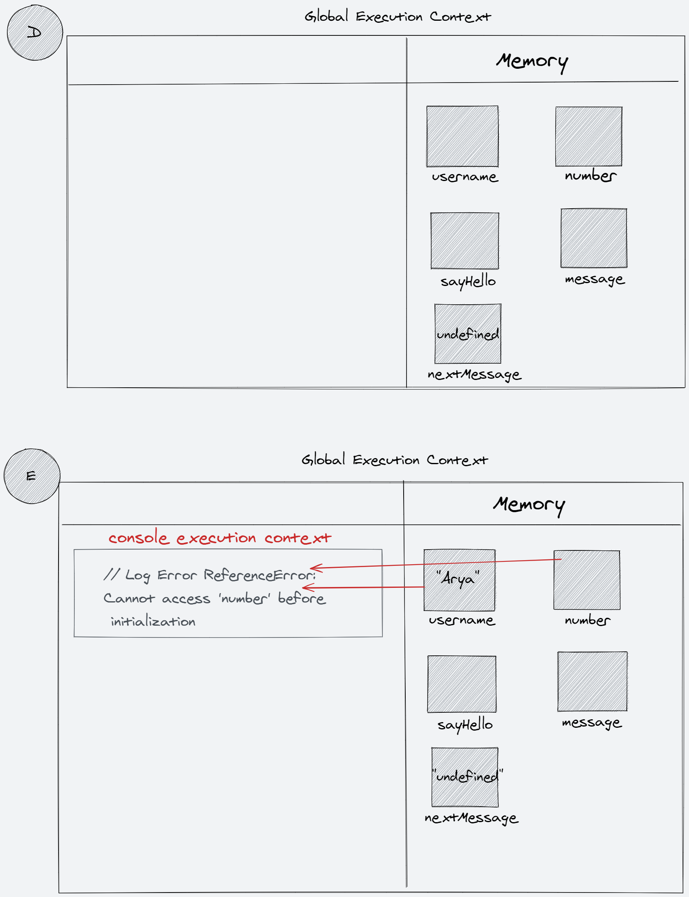
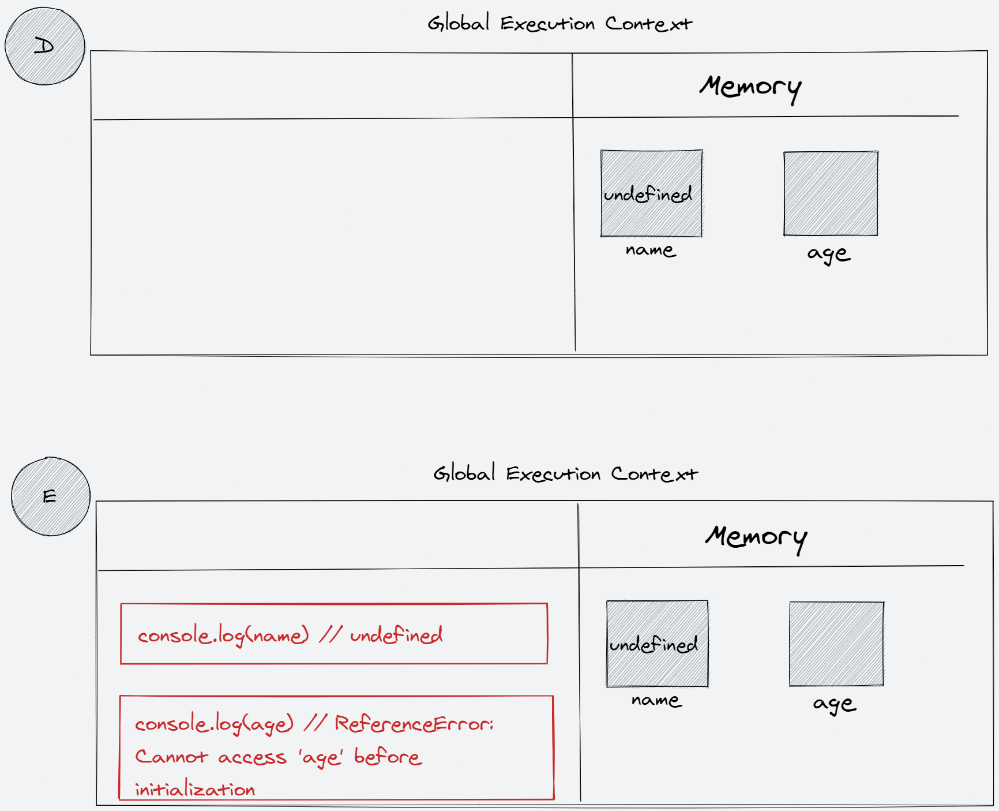
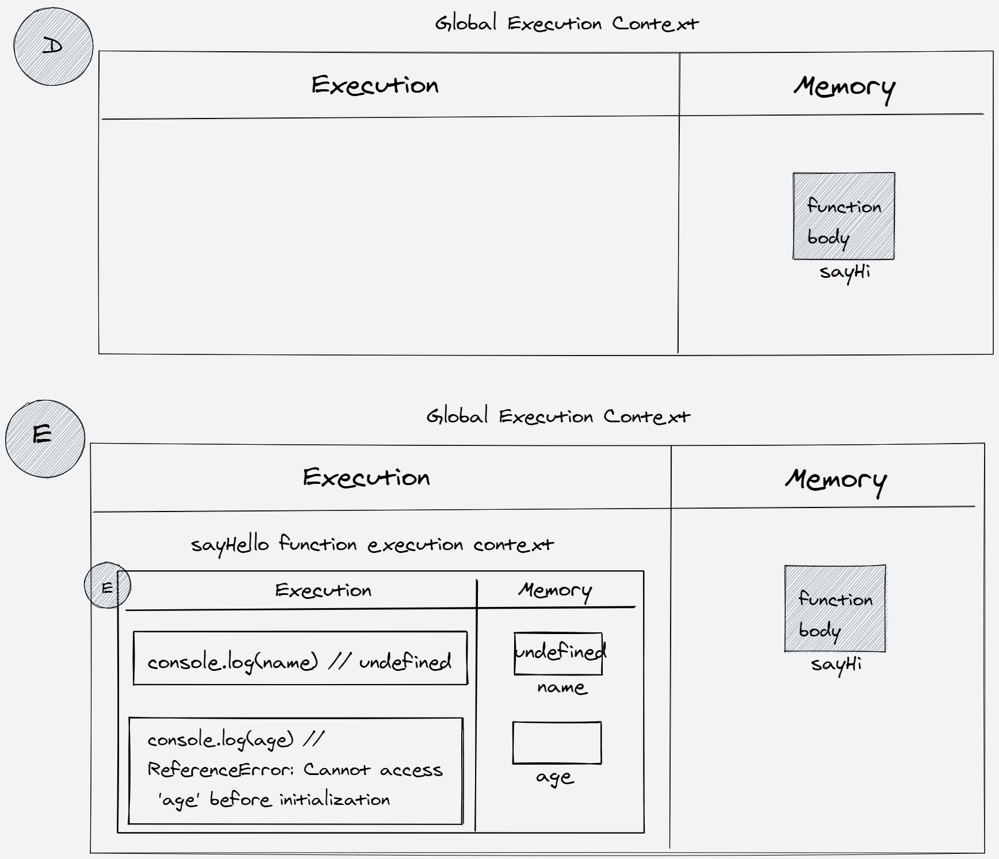
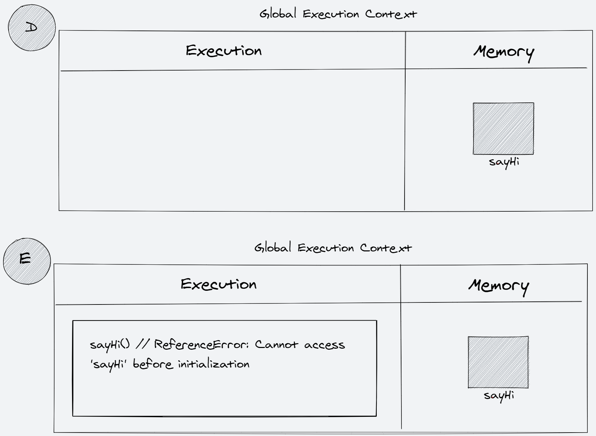
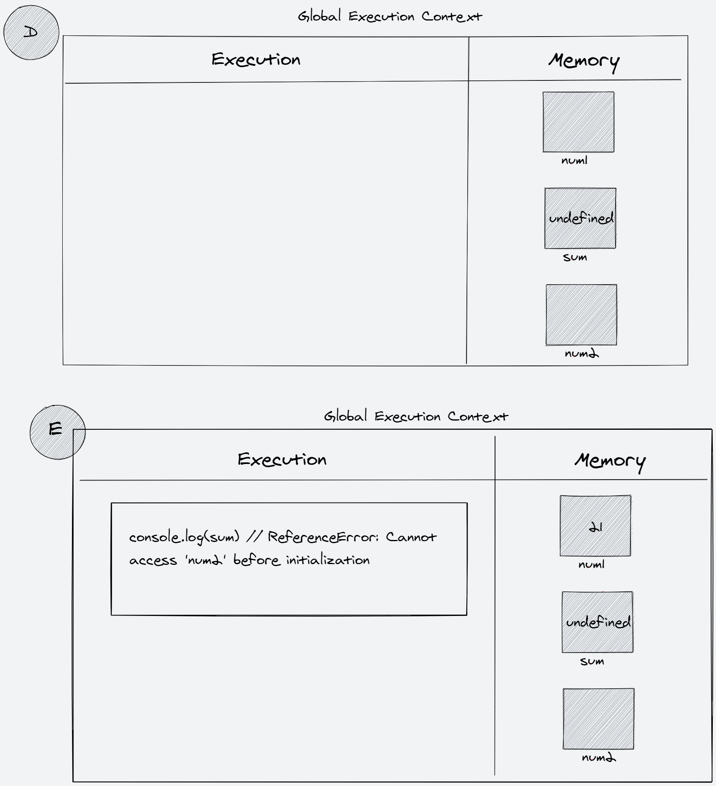
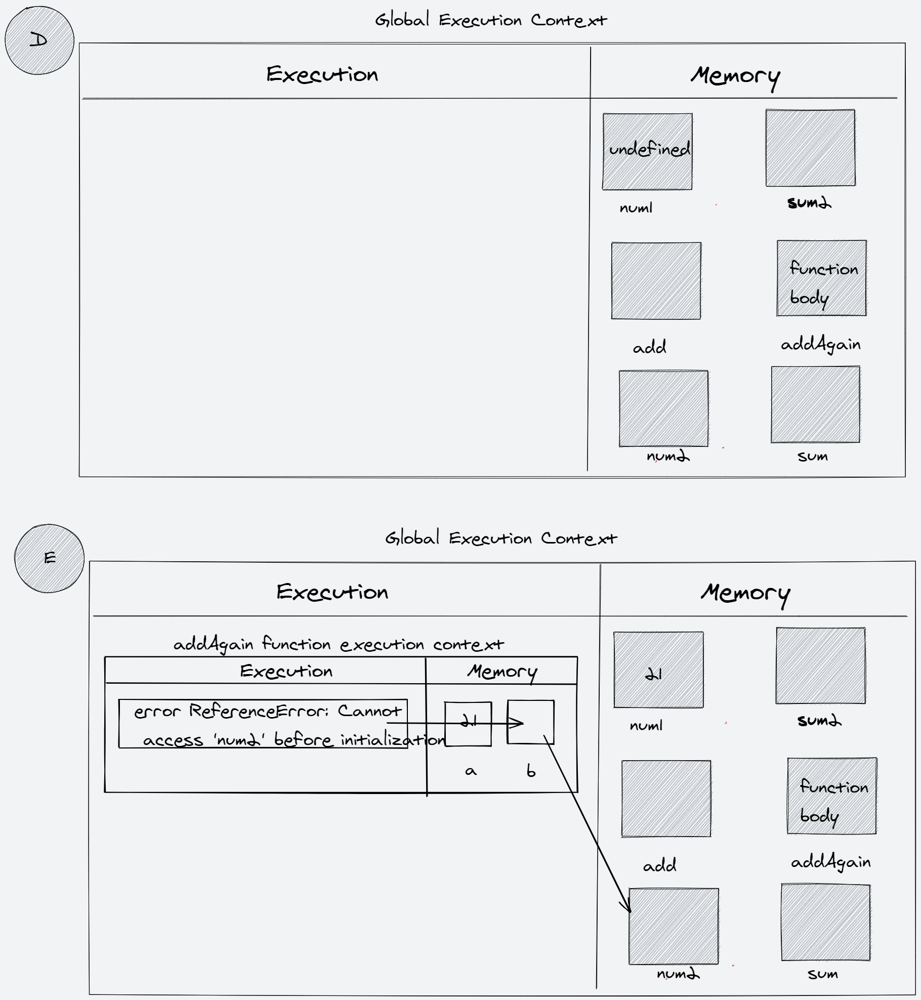
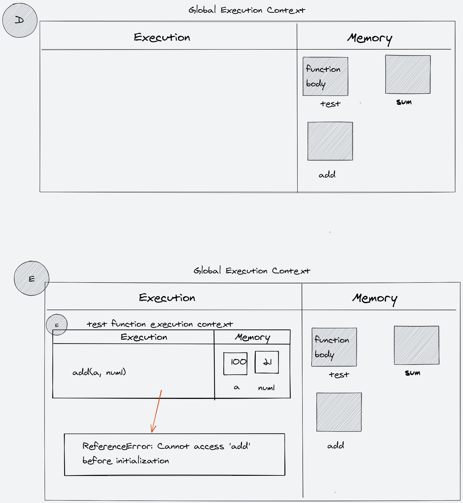
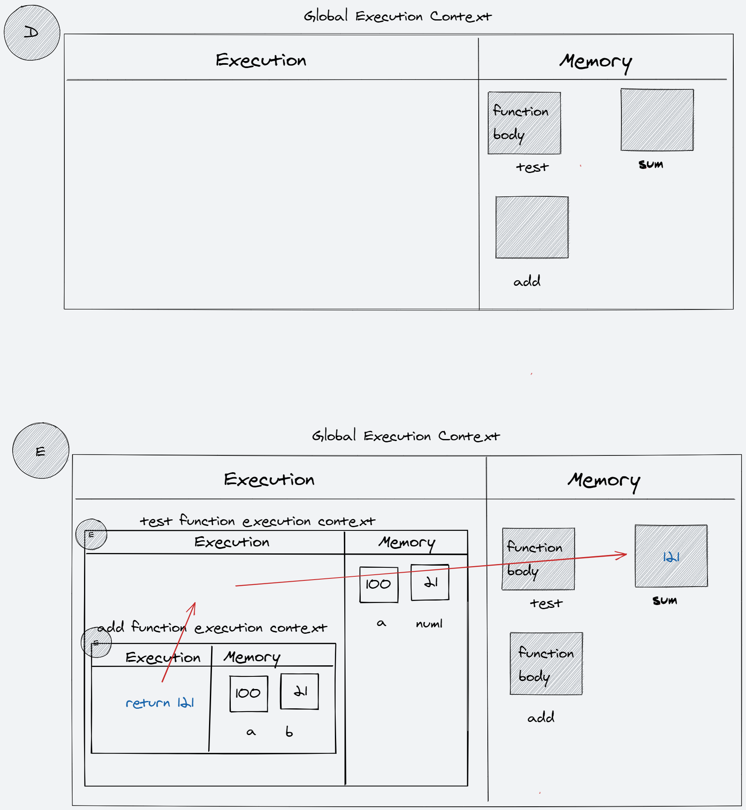

For the given code below:

- create the execution context diagram
- re-write the code in ways that system will understand/interprete

1.

```js
var username = 'Arya';
let brothers = ['John', 'Ryan', 'Bran'];

console.log(username, brothers[0]);

function sayHello(name) {
  return `Hello ${name}`;
}

let message = sayHello(username);
var nextMessage = sayHello('Test');
```


### Interprete

```js

// Declaration phase

var username;
let brothers;

function sayHello(name) {
  return `Hello ${name}`;
}

let message;
var nextMessage;

// Execution phase

username = 'Arya';
brothers = ['John', 'Ryan', 'Bran'];

console.log(username, brothers[0]); // "Arya", "John"

message = sayHello(username);
nextMessage = sayHello('Test');
```

2.

```js
console.log(username, number);

var username = 'Arya';
let number = 21;

function sayHello(name) {
  return `Hello ${name}`;
}

let message = sayHello(username);
var nextMessage = sayHello('Test');
```


### Interprete

```js

// Declaration phase

var username;
let number;

function sayHello(name) {
  return `Hello ${name}`;
}

let message;
var nextMessage;

// Execution phase

console.log(username, number); // ReferenceError: Cannot access 'number' before initialization
```

3.

```js
console.log(username, numbers);

let username = 'Arya';
let number = 21;

let sayHello = function (name) {
  return `Hello ${name}`;
};

let message = sayHello(username);
var nextMessage = sayHello('Test');
```


### Interprete

```js

// Declaration phase

let username;
let number;

let sayHello;

let message;
var nextMessage;

// Execution phase

console.log(username, number); // ReferenceError: Cannot access 'username' before initialization
```

4.

```js
let username = 'Arya';
console.log(username, numbers);

let number = 21;
let message = sayHello(username);

let sayHello = function (name) {
  return `Hello ${name}`;
};

var nextMessage = sayHello('Test');
```



### Interprete

```js

// Declaration phase

let username;
let number;

let sayHello;

let message;
var nextMessage;

// Execution phase

username = "Arya";
console.log(username, number); // ReferenceError: Cannot access 'number' before initialization
```

5.

```js
console.log(name);
console.log(age);
var name = 'Lydia';
let age = 21;
```



### Interprete

```js

// Declaration phase

var name;
let age;

// Execution phase

console.log(name) // undefined
console.log(age); // ReferenceError: Cannot access 'age' before initialization
```

6.

```js
function sayHi(name) {
  console.log(name);
  console.log(age);
  var name = 'Lydia';
  let age = 21;
}

sayHi();
```



### Interprete

```js
function sayHi(name) {

  var name;
  let age;

  console.log(name);
  console.log(age);

  name = 'Lydia';
  age = 21;
}

sayHi();
```

7.

```js
sayHi();
function sayHi(name) {
  console.log(name);
  console.log(age);
  var name = 'Lydia';
  let age = 21;
}
```


### Interprete

```js
// function declration get hosited in decalration phase


// declaration phase
function sayHi(name) {

  // execution phase

  var name;
  let age;

  console.log(name);
  console.log(age);

  name = 'Lydia';
  age = 21;
}

// Execution phase
sayHi();
```

8.

```js
sayHi();
let sayHi = function sayHi(name) {
  console.log(name);
  console.log(age);
  var name = 'Lydia';
  let age = 21;
};
```



### Interprete

```js
let sayHi;

sayHi() // ReferenceError: Cannot access 'sayHi' before initialization
```

9.

```js
let num1 = 21;
console.log(sum);
var sum = num1 + num2;
let num2 = 30;
```



### Interprete

```js
let num1;
var sum;
let num2;

num1 = 21;

sum = num1 + num2 // ReferenceError: Cannot access 'num2' before initialization
```

10.

```js
var num1 = 21;

let sum2 = addAgain(num1, num2, 4, 5, 6);

let add = (a, b, c, d, e) => {
  return a + b + c + d + e;
};
function addAgain(a, b) {
  return a + b;
}
let num2 = 200;

let sum = add(num1, num2, 4, 5, 6);
```



### Interprete

```js

// Declaration Phase

var num1;
let sum2;
let add;
function addAgian(a, b) {
  return a + b;
}
let num2;
let sum;

// Execution phase

num1 = 21;
sum2 = addAgain(num1, num2, 4, 5, 6); // ReferenceError: Cannot access 'num2' before initialization
```

11.

```js
function test(a) {
  let num1 = 21;
  return add(a, num1);
}

let sum = test(100);

let add = (a, b) => {
  return a + b;
};
```



### Interprete

```js
function test(a) {
  let num1 = 21;
  return add(a, num1);
}

let sum;
let add;

// Execution Phase

sum = test(100);  // ReferenceError: Cannot access 'add' before initialization
```

12.

```js
function test(a) {
  let num1 = 21;
  return add(a, num1);
}

let sum = test(100);

function add(a, b) {
  return a + b;
}
```



### Interprete

```js
function test(a) {
  let num1 = 21;
  return add(a, num1);
}

let sum;

function add(a, b) {
  return a + b;
}

sum = test(100); // sum = 121;
```